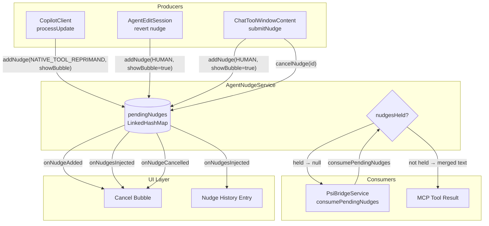
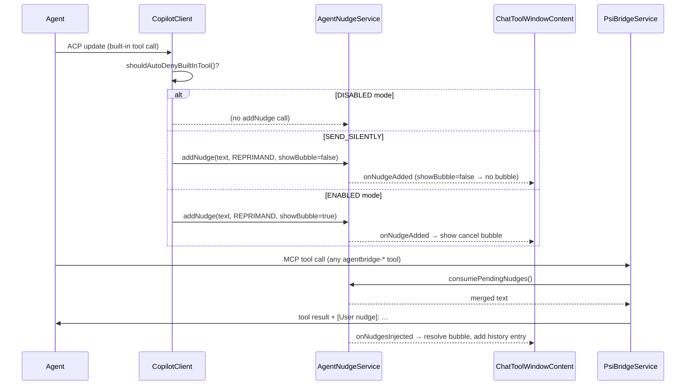
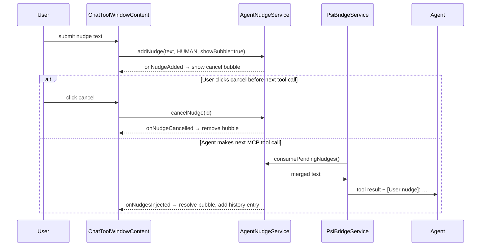

# Agent Nudge Architecture

Nudges are short-lived instructions injected into the next MCP tool result to steer the agent's
behaviour mid-turn — either because the user explicitly typed one, or because the system detected
undesirable tool usage and wants to reprimand the agent.

---

## Components

| Component               | Role                                                                                                                                                                |
|-------------------------|---------------------------------------------------------------------------------------------------------------------------------------------------------------------|
| `AgentNudgeService`     | **Single source of truth.** Owns the pending nudge queue, IDs, coalescing, injection gating, and listener dispatch.                                                 |
| `ChatToolWindowContent` | **UI subscriber.** Registers an `AgentNudgeService.Listener` to manage the cancel-bubble and history entry. Holds only display-layer references (`activeBubbleId`). |
| `CopilotClient`         | **Reprimand producer.** Detects native tool usage in `processUpdate()` and decides whether to add a REPRIMAND nudge based on `ReprimandNudgeMode`.                  |
| `AgentEditSession`      | **Revert nudge producer.** Fires a HUMAN nudge when the user declines or reverts an agent edit.                                                                     |
| `PsiBridgeService`      | **Consumer / injector.** Calls `consumePendingNudges()` when returning each MCP tool result, appending the merged text as `[User nudge]: …`.                        |
| `ReprimandNudgeMode`    | **Setting.** `DISABLED` / `SEND_SILENTLY` / `ENABLED` — checked by `CopilotClient` before calling `addNudge`.                                                       |

---

## Data model

```
NudgeEntry
  id         String      UUID (e.g. "550e8400-e29b-41d4-a716-446655440000")
  text       String      the instruction text
  source     NudgeSource HUMAN | NATIVE_TOOL_REPRIMAND | TOOL_ABUSE_REPRIMAND
  showBubble boolean     whether the UI should show a cancel bubble
```

HUMAN nudges **accumulate** (all are kept). Each REPRIMAND type **coalesces within its own type**
— a new `NATIVE_TOOL_REPRIMAND` replaces any existing one, and a new `TOOL_ABUSE_REPRIMAND`
replaces any existing `TOOL_ABUSE_REPRIMAND`, but the two types do not interfere with each other.

---

## System overview



---

## REPRIMAND nudge lifecycle

Triggered when the agent calls a native tool (bash, grep, read…) instead of the MCP equivalent.



---

## HUMAN nudge lifecycle

User types an instruction in the nudge input box and submits it.



---

## Coalescing rules

| Source                  | Behaviour on new `addNudge`                                                    |
|-------------------------|--------------------------------------------------------------------------------|
| `NATIVE_TOOL_REPRIMAND` | Replaces any existing `NATIVE_TOOL_REPRIMAND` silently. No `onNudgeCancelled`. |
| `TOOL_ABUSE_REPRIMAND`  | Replaces any existing `TOOL_ABUSE_REPRIMAND` silently. No `onNudgeCancelled`.  |
| `HUMAN`                 | All HUMAN nudges kept; merged human-first when consumed.                       |

The two reprimand types coalesce **independently** — a new `NATIVE_TOOL_REPRIMAND` will not
remove a pending `TOOL_ABUSE_REPRIMAND` and vice versa.

Mixed queue consumed text order: `[HUMAN text]\n\n[REPRIMAND text(s)]`.

---

## Injection gating (`nudgesHeld`)

While a **sub-agent** is active, `setNudgesHeld(true)` prevents `consumePendingNudges()` from
returning anything. Nudges queue up silently and are injected into the first tool call after the
main agent resumes (`setNudgesHeld(false)`).

---

## Turn-start cleanup

`CopilotClient.beforeSendPrompt()` calls `clearHumanNudges()` before each turn is sent.
This silently drops any HUMAN nudges that were pending but not delivered (e.g. user submitted a
nudge but no tool call happened to inject it). Reprimands survive into the next turn.

`restoreUnhandledNudgeIfNeeded()` in `ChatToolWindowContent` uses the locally-tracked
`pendingHumanText` to restore the user's undelivered text back to the input box — so the user
doesn't lose their manually-typed instruction.

---

## Key invariants

1. **All nudge state lives in `AgentNudgeService`.** The UI holds only `activeBubbleId` (a
   display-layer reference, not the nudge itself).
2. **Callers decide `showBubble` and source** before calling `addNudge`. The service has no
   knowledge of `ReprimandNudgeMode`.
3. **Listener callbacks fire synchronously** on the calling thread. UI listeners wrap in
   `ApplicationManager.getApplication().invokeLater(…)`.
4. **`clearHumanNudges()` fires no events.** It is a silent purge — not a cancellation.
5. **`cancelNudge()` fires `onNudgeCancelled`.** It is for explicit user-initiated cancellation
   only (cancel button). Coalescing and turn-start cleanup do not use it.
